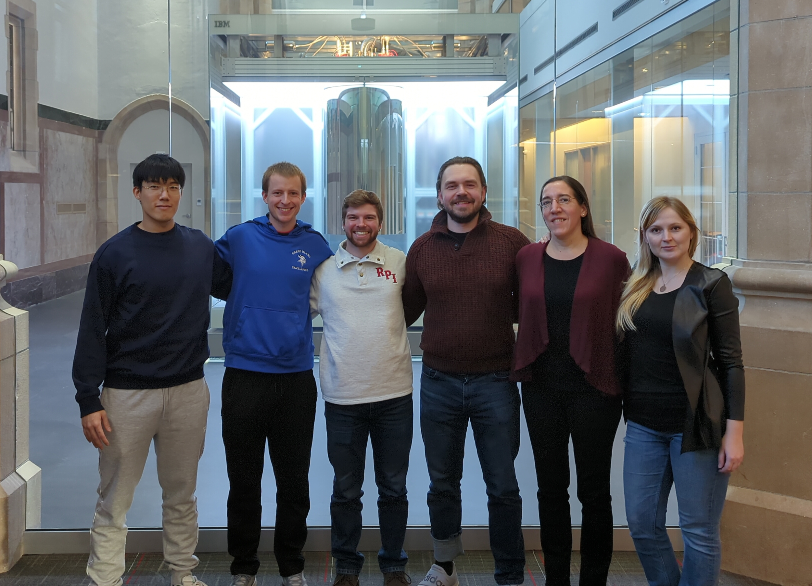

# Members

### Founder & Team Leader
- **Alexander "Sasha" Lutsevich** (Ph.D. candidate, Cognitive Science)

### Editors
- **Jitka Kadlecikova** (Ph.D. student, Cognitive Science)
- **Gwendolyn Morgan** (Ph.D. student, Cognitive Science)
- **Reno Malanga** (Ph.D. student, Cognitive Science)

### Tech Support
- **Joseph Killian** (Ph.D. student, Cognitive Science)
- **Inwon Kang** (Ph.D. student, Computer Science)

***Left To Right**: Inwon Kang, Joseph Killian, Reno Malanga, Alexander "Sasha" Lutsevich, Gwendolyn Morgan, Jitka Kadlecikova*

---
# Contributors

Thank you for sharing your knowledge,

| Name                        | Name              |
| --------------------------- | ----------------- |
| Alexander "Sasha" Lutsevich | Diyanko Bhowmik   |
| Klara Lutsevich             | Rochelle Kaper    |
| Sombuddha Chatterjee        | Tiburon Benavides |
| Milena Jonas                | Jade Franklin     |
| Jitka Kadlecikova           | Gwendolyn Morgan  |
| Mincong "Jerry" Huang       | Reno Malanga      |
| Jianing Silven Chen         |                   |

---
_Have knowledge/edits to share? See the [CONTRIBUTE](../CONTRIBUTE.md) page._
